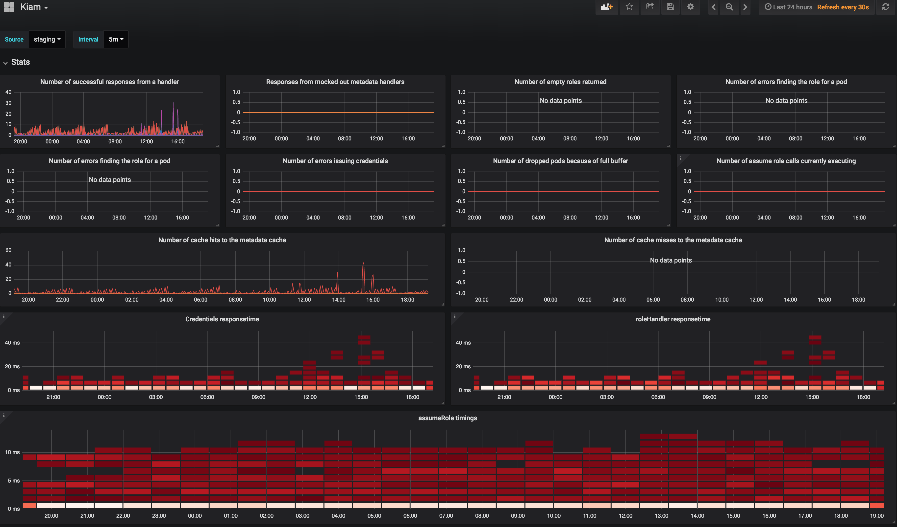
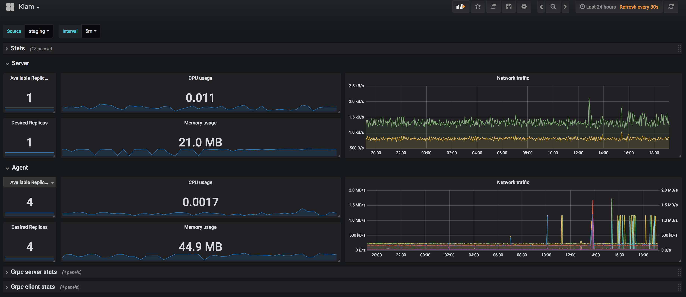
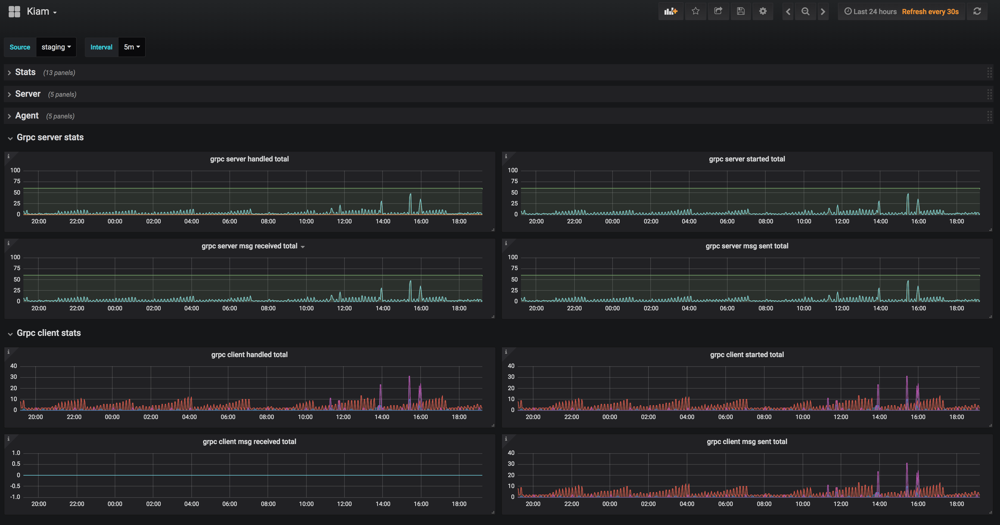

# Metrics

Kiam can exports both Prometheus and StatsD metrics to determine the health of the
system, check the timing of each RPC call, and monitor the size of the
credentials cache. By default, Prometheus metrics are exported on `localhost:9620`.
StatsD metrics is disabled by default, read below on how to enable them.

## Dashboard

A example Grafana dashboard with Prometheus as datasource is provided [here](dashboard-prom.json), it displays the basic metrics and includes
daemonset status from kube-state-metrics & container metrics from cAdvisor if available.

## Metrics configuration

- The `statsd` flag controls the address to which to send StatsD metrics.
  This is by default `""`. To enable statsD provide a server adress,
  for example `127.0.0.1:8125`
- The `statsd-prefix` flag controls the initial prefix that will be appended to
  Kiam's StatsD metrics. This is by default `kiam`.
- The `statsd-interval` flag controls how frequently the in-memory metrics
  buffer will be flushed to the specified StatsD endpoint. Metrics are
  not aggregated in this buffer and the raw counts will be flushed to the
  underlying StatsD sink. This is by default `100ms`.
- The `prometheus-listen-addr` controls which address Kiam should create a
  Prometheus endpoint on. This is by default `localhost:9620`. The metrics
  themselves can be accessed at `<prometheus-listen-addr>/metrics`.
- The `prometheus-sync-interval` flag controls how frequently Prometheus
  metrics should be updated. This is by default `5s`.

## Emitted Metrics

### Prometheus

#### Metadata Subsystem

- `handler_latency_milliseconds` - Bucketed histogram of handler timings. Tagged by handler
- `credential_fetch_errors_total` - Number of errors fetching the credentials for a pod
- `credential_encode_errors_total` - Number of errors encoding credentials for a pod
- `find_role_errors_total` - Number of errors finding the role for a pod
- `empty_role_total` - Number of empty roles returned
- `success_total` - Number of successful responses from a handler
- `responses_total` - Responses from mocked out metadata handlers

#### STS Subsystem

- `cache_hit_total` - Number of cache hits to the metadata cache
- `cache_miss_total` - Number of cache misses to the metadata cache
- `issuing_errors_total` - Number of errors issuing credentials
- `assumerole_timing_milliseconds` - Bucketed histogram of assumeRole timings
- `assumerole_current` - Number of assume role calls currently executing

#### K8s Subsystem

- `dropped_pods_total` - Number of dropped pods because of full buffer

#### gRPC Server (Kiam Server)

- `grpc_server_handled_total` - Total number of RPCs completed on the server, regardless of success or failure.
- `grpc_server_msg_received_total` - Total number of RPC stream messages received on the server.
- `grpc_server_msg_sent_total` - Total number of gRPC stream messages sent by the server.
- `grpc_server_started_total` - Total number of RPCs started on the server.

#### gRPC Client (Kiam Agent)

- `grpc_client_handled_total` -  Total number of RPCs completed by the client, regardless of success or failure.
- `grpc_client_msg_received_total` -  Total number of RPC stream messages received by the client.
- `grpc_client_msg_sent_total` -  Total number of gRPC stream messages sent by the client.
- `grpc_client_started_total` -  Total number of RPCs started on the client.

### StatsD Timing metrics

- `gateway.rpc.GetRole` - Observed client side latency of GetRole RPC
- `gateway.rpc.GetCredentials` - Observed client side latency of GetCredentials RPC
- `server.rpc.GetRoleCredentials` - Observed server side latency of GetRoleCredentials RPC
- `server.rpc.IsAllowedAssumeRole` - Observed server side latency of IsAllowedAssumeRole RPC
- `server.rpc.GetHealth` - Observed server side latency of GetHealth RPC
- `server.rpc.GetPodRole` - Observed server side latency of GetPodRole RPC
- `server.rpc.GetRoleCredentials` - Observed server side latency of GetRoleCredentials RPC
- `handler.role_name` - Observed latency of role_name handler
- `handler.health` - Observed latency of health handler
- `handler.credentials` - Observed latency of credentials handler
- `aws.assume_role` - Observed latency of aws assume role request
